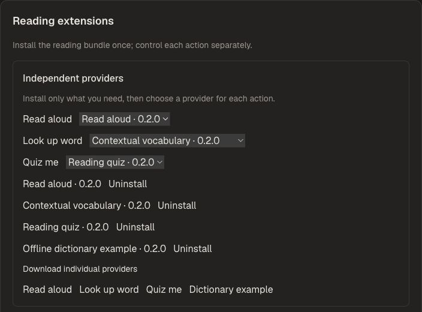

# DeepTutor reading extensions

Three independently authorized actions in one Python wheel: read aloud,
contextual word lookup, and reading-comprehension quizzes.

Requires DeepTutor 1.6.4 or later (before 2.0), Python 3.11–3.14,
and Reading protocol 1. The managed installer requires the host integration
in HKUDS/DeepTutor PR #1233 (or a release containing it).

## Preview

Actual local deployment on port 3782. Three independent providers are selected;
the dictionary example is installed as an optional alternative.



See [local Docker deployment and rollback](docs/LOCAL_DEPLOYMENT.md).

## Install

Download the versioned wheel from this repository's Releases.
In DeepTutor, open Settings → Reading extensions and upload the wheel, or run:

```sh
deeptutor plugin reading install ./deeptutor_reading_extensions-0.1.0-py3-none-any.whl
deeptutor plugin reading list
```

Restart the backend after installation, updates, changes to enabled actions,
or uninstall. No frontend rebuild is needed after the host integration is deployed.
The managed package lives under the runtime home's data/system/reading-plugins,
so retain the data volume when rebuilding a container.

`deeptutor plugin reading uninstall` disables the three actions after restart.
`deeptutor plugin reading restore` restores the host's bundled versions.

Standard Python entry-point installation also works with the integrated host:
`python -m pip install ./deeptutor_reading_extensions-0.1.0-py3-none-any.whl`
using the backend interpreter. Use either managed installation or pip; the
managed lifecycle takes precedence when configured.

## Develop

```sh
python -m pip install build
python -m build --wheel
```

The implementation originates from HKUDS/DeepTutor and retains its Apache-2.0
license. The package uses the host's verified ReadingContext and LLM services.
It does not bundle provider credentials or material data.

## Independent installation (v0.2.0)

Requires the provider-management version of host PR #1233. Existing hosts need a one-time frontend/backend upgrade; installing a wheel alone does not add the management page.

| Wheel | Contents |
| --- | --- |
| `deeptutor_reading_extensions` | Convenient bundle of all three actions |
| `deeptutor_reading_read_aloud` | Read aloud only |
| `deeptutor_reading_vocabulary` | Context-grounded vocabulary only |
| `deeptutor_reading_quiz` | Quiz only |
| `deeptutor_reading_dictionary_example` | Three-entry offline dictionary example |

Open **Settings → Reading extensions**, trust the publisher, download an individual provider, then choose it in the action's provider selector. Restart the backend. You can install competing dictionaries and select one without uninstalling the others. Uninstalling one provider does not uninstall other packages.

```sh
deeptutor plugin reading update --package deeptutor-reading-dictionary-example
deeptutor plugin reading provider vocabulary --package deeptutor-reading-dictionary-example
# Restart the backend before using the selected provider.
deeptutor plugin reading remove deeptutor-reading-dictionary-example
```

Third-party developers can upload a compatible wheel; automatic online downloads are restricted to this repository's published packages. See the [provider contract and plugin roadmap](docs/PLUGIN_DESIGN.md).

## v0.2.1: reading-session model selection

Vocabulary and quiz providers now use the model selected in the reading conversation. Update both the host from [DeepTutor PR #1233](https://github.com/HKUDS/DeepTutor/pull/1233) and the selected provider packages, then restart the backend. A wheel update alone cannot fix host selection handling or error feedback. Read aloud and the offline dictionary example do not require a model.

The host checks account model grants, reports missing configuration separately from provider errors, and permits retry after an asynchronous timeout. A synchronous provider still running after timeout must finish before another action can start.

This patch has automated regression coverage. Real learner EPUB/PDF/text acceptance is still pending; the management preview above is not evidence of a successful reading action.
